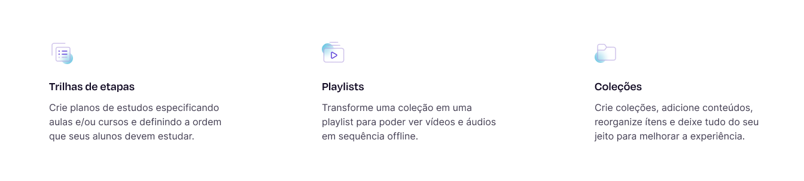

## :rocket: Teste técnico para Desenvolvedor(a) Front-end Junior na Ensinio

O presente teste foi cuidadosamente planejado para validar os conhecimentos necessários para a posição de Desenvolvedor(a) Front-end Junior na Ensinio.

Serão avaliados aspectos relacionados aos conhecimentos em boas práticas de desenvolvimento, além dos conhecimentos nas tecnologias HTML, CSS, JavaScript, React.js e no ecossistema que as cerca.

É esperado que você codifique uma interface de forma eficiente e elegante (estamos confiantes de que você pode vencer a vontade de fazer gambiarras :stuck_out_tongue_winking_eye:), e demonstre sua atenção em detalhes, capacidade de aprender e agregar valor.

Recomendamos partir da premissa fictícia de que, embora o sistema proposto seja simples, ele está sendo desenvolvido para compor um projeto de larga escala, portanto seu código deve estar à altura.

Esperamos também que você se divirta e aprenda algo no processo. :blush:

## :eyes: O problema

Uma interface feita por um designer inspirado, rs.

- https://www.figma.com/file/M0jy5rqNumytQKuKZYhgPS/Ensinio-Frontend-Challenge

## :bulb: A proposta

Você deve codificá-la :smiley:, utilizando HTML, CSS, JavaScript e React.js.

Encorajamos o uso de bibliotecas CSS-in-JS como styled-components, sobretudo visando delimitar o escopo da estilização (em seus respectivos componentes), mas para as finalidades deste teste técnico, não é permitido o uso de Bootstrap, Tailwind CSS e congêneres.

Para a seção abaixo (vide imagem), os títulos e descrições dos itens devem ser requisitados de uma API fictícia. Utilize o [json-server](https://github.com/typicode/json-server) para simular uma API com o arquivo "db.json" contido neste repositório.

Por fim, forneça uma documentação, por meio de um arquivo README.md, acerca do seu projeto. Inclua instruções completas para a execução da aplicação, e comentários que julgar pertinentes à avaliação.

## :dart: Requisitos do projeto

- A interface deve ser 100% responsiva;
- Fazer uso de uma ou mais ferramentas "linter";
- Usabilidade impecável (botões devem ter cursor do tipo pointer, feedbacks visuais de hover, etc);
- Requisitar dados (presentes no arquivo "db.json") de uma API fictícia utilizando [json-server](https://github.com/typicode/json-server);
- Fornecer uma documentação, incluindo instruções para a execução da sua aplicação;

## :clap: Diferenciais

- Animações;
- Escrever um ou mais testes de unidade :)

## :page_facing_up: Critérios de avaliação

- A qualidade do seu **código**;
- O cumprimento dos **requisitos**;
- A **fidelidade** da interface codificada;
- A **estrutura** do seu projeto: esperamos ver componentização coesa, reuso, encapsulamento, separação de responsabilidades, etc;
- A **responsividade** da aplicação: deve adaptar-se com maestria para absolutamente qualquer tamanho de tela, desde pequenos smartphones até monitores ultrawide;
- Seu **empenho**: não tem problema se algo não sair como desejado, mas tente! :blush:

## :email: Sobre a entrega

Pedimos que, por gentileza, entregue o teste em até 7 dias a partir do recebimento das instruções, preenchendo [este formulário](https://ensinio.atlassian.net/servicedesk/customer/portal/9/group/12/create/55) com o link de um **repositório privado** no GitHub. Neste repositório, adicione como colaboradores os usuários [@silviow](https://github.com/silviow) (silvio.mms2016@gmail.com) e [@guiavila](https://github.com/guiavila).

Se por motivos de força maior não for possível cumprir com o prazo, por gentileza, nos informe via email. 

Qualquer dúvida, [entre em contato](https://www.linkedin.com/in/silviow/) :muscle:
